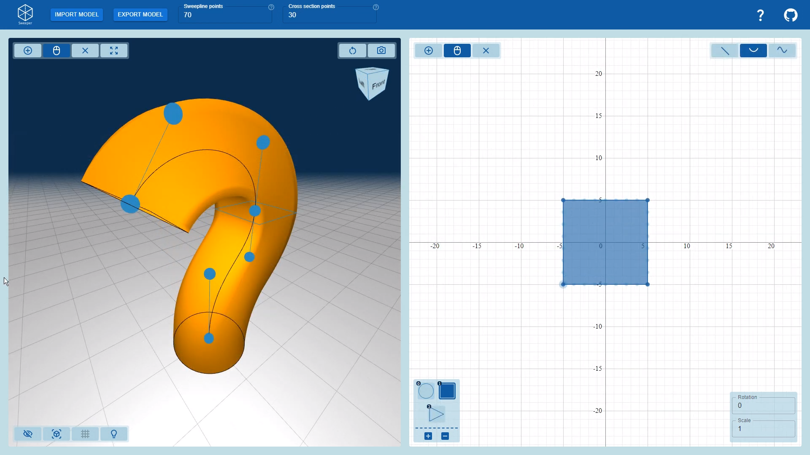

# Sweeper

Sweeper is a web based application that allows users to create a wide variety of 3D shapes, by specifying a sweep-line and a number of cross-sections that are placed along this line. This application can be accessed at [tarvk.github.io/3D-sweep-object/build/](https://tarvk.github.io/3D-sweep-object/build/).

Below is an example of the types of objects that can be created:


## Motivation

This application was developed for the 2IMV10 Visual Computing Project at the TU/e.
In this course we had the choice of creating an application for one of 11 different topics, one being sweep-objects. The exact requirements and goals for the application could be entirely determined by the students.

We chose to make a web-application to allow users to easily create advanced objects without needing to have experience with complex CAD software.
Throughout the project we focused on keeping the UI clean and intuitive, while also keeping it flexible and precise enough to be able to create a variety of complex shapes.

### Credits

Sweeper was developed by group 8a-2022, consisting of:

-   Boris Rokanov
-   Georgi Kostov
-   Tar van Krieken

The application is entirely OS under the MIT license, allowing anyone to use it however they please.

## Usage

Below is a demonstration/explanation video of the application. This video can also be accessed by clicking the question mark in the application itself.

[](https://www.youtube.com/watch?v=15veuH4wk1k)

The application primarily consists of two views:

-   The 3D view on the left, which is used for editing the 3D sweep line and viewing the resulting mesh
-   The 2D view on the right, which is used to edit the cross-sections of the object



The application allows for meshes to be exported in 4 formats:

-   Obj: Encodes the mesh, allowing it to be imported into a variety of different programs
-   Stl: Encodes the mesh, allowing it to be imported into a variety of different programs
-   Png: Takes a screenshot of the 3D view excluding the UI on top
-   JSON: Writes a JSON file consisting of the specifications of the object

The JSON obtained from the export can later be imported to continue working on a previous object.

The application also has two hidden features accessed by shortcuts:

-   `ctrl+p`: toggles "plain mode" which hides aspects of the 3D view in order to take cleaner screenshots
-   `ctrl+o`: toggles "animation mode" which animates the process of sweeping along the sweep-line

## Local usage

Local usage will require [node.js](https://nodejs.org/en/) to be installed.

To install the remaining dependencies of this project, open a terminal at the root of this project and run:

```
npm install
```

After installation is done, the project can be started using:

```
npm run start
```

Static build files can be generated using:

```
npm run build
```
